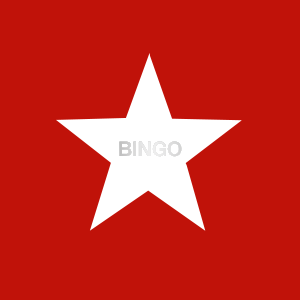

# SterniBingo

A stupid app for the stupid Sternburg Bingo.

I made this because I'm too lazy to manually search each number on the bingo sheets and because it was fun to overengineer this.

Cheers!

This software is licensed as [Beerware](LICENSE.md).

## Development

#### TODOs
* improve styling
* add some sweet ANIMATIONS
* handle corner cases: double bingo for one cap
* better readme for when i return to this project in a year
* improve the first run experience
* improve display of "meine kronkorken"
* add some data science